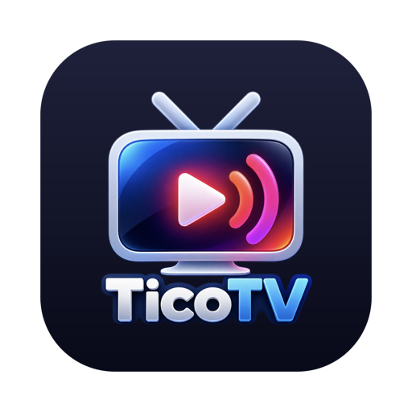
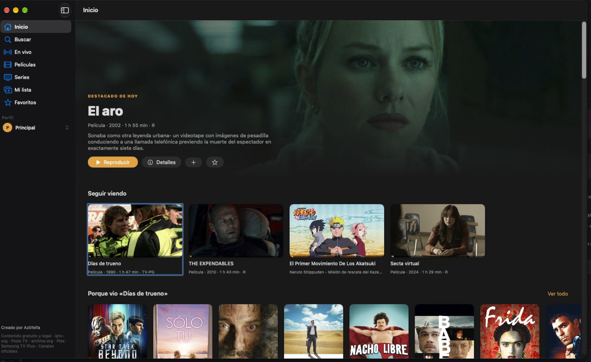

  

<h1 align="center">TicoTV</h1>

  <b>TV en vivo, películas y series en español reunidas en una app nativa para Mac.</b> 
  Sin cuenta de TicoTV, sin suscripción de TicoTV y sin telemetría propia.

  Creado por <a href="https://github.com/Az0feifa"><b>Az0feifa</b></a> · Costa Rica 🇨🇷

  
  
  
  

  

  macOS 14 o superior · Apple Silicon e Intel · <a href="https://github.com/Az0feifa/TicoTV/releases/latest/download/TicoTV.pkg">Instalador .pkg</a> · <a href="#instalación">Cómo instalar</a>

  

---

## ¿Qué es TicoTV?

TicoTV es una aplicación nativa para macOS que reúne en una sola interfaz distintas fuentes externas de contenido audiovisual disponible a través de Internet.

La aplicación puede consultar contenido y transmisiones procedentes de fuentes como Pluto TV, Plex, Samsung TV Plus, iptv-org, Internet Archive y transmisiones configuradas de distintas televisoras.

TicoTV funciona como cliente: el dispositivo del usuario solicita los datos y las transmisiones directamente a infraestructura externa. El proyecto se publica gratuitamente para uso personal y otros usos no comerciales permitidos por su licencia.

### Lo que TicoTV no hace

TicoTV:

- no opera servidores propios de video;
- no vende suscripciones ni acceso a canales;
- no proporciona credenciales de servicios de pago;
- no elimina ni evade sistemas DRM;
- no requiere una cuenta propia;
- no incorpora sistemas propios de analítica o telemetría;
- no almacena una copia permanente del contenido audiovisual de los proveedores.

La disponibilidad de una fuente puede variar según el proveedor, la región, el momento y las condiciones técnicas del servicio.

---

## Fuentes de contenido

| Fuente | Cómo se utiliza |
|---|---|
| **Pluto TV** | Consulta servicios de Pluto TV para catálogo, canales, guía y URLs de reproducción. |
| **Plex** | Utiliza servicios de Plex con un identificador anónimo para consultar contenido disponible para ese cliente. |
| **Samsung TV Plus** | Consulta un índice externo en i.mjh.nz y utiliza jmp2.uk para resolver determinadas URLs de reproducción. |
| **Canales configurados** | Reproduce URLs asociadas a televisoras e instituciones desde infraestructura externa. |
| **iptv-org** | Consulta playlists públicas que contienen enlaces a transmisiones externas. |
| **Internet Archive** | Utiliza búsqueda y metadatos de Internet Archive para localizar material audiovisual. |

La inclusión de una fuente **no implica afiliación, patrocinio, aprobación ni asociación** entre TicoTV y el proveedor correspondiente.

Los servicios externos mantienen sus propias condiciones, políticas, restricciones geográficas, marcas, licencias y derechos.

Consulte [THIRD_PARTY.md](THIRD_PARTY.md) para más información.

---

## Funciones

### Para ver

- 🏠 **Inicio** con contenido destacado y filas por categoría.
- 🔎 **Búsqueda global** con ⌘F.
- 📺 **Televisión en vivo** organizada por fuentes y categorías.
- 🎬 **Películas** y 🎞️ **series** cuando la fuente correspondiente las ofrece.
- 📋 **Guía de programación** en fuentes compatibles.

### Comodidad

- ⏯️ **Seguir donde quedó**.
- ⏭️ **Siguiente episodio automático**.
- 🌙 **Temporizador para dormir**.
- 🗣️ Selección de **audio y subtítulos** cuando están disponibles.
- 📡 **AirPlay**.
- ⌨️ Compatibilidad con controles multimedia de macOS.
- ➕ **Mi lista**.
- ⭐ **Favoritos**.
- 👥 **Perfiles locales**.
- 💡 Recomendaciones locales basadas en el historial.

### Atajos de teclado

| Tecla | Acción |
|---|---|
| espacio | Pausa / reproduce |
| f | Pantalla completa |
| esc | Minimiza el reproductor / regresa |
| ← → | Retrocede o adelanta 10 s |
| n | Siguiente episodio |
| ⌘F | Buscar |
| ⌘R | Actualizar catálogo |
| ⌘1–⌘7 | Navegar entre secciones |

---

## Instalación

### Opción 1: descargar e instalar

**1. Descargue** (la descarga empieza al hacer clic):

| Archivo | Uso |
|---|---|
| **[⬇️ TicoTV.dmg](https://github.com/Az0feifa/TicoTV/releases/latest/download/TicoTV.dmg)** | Recomendado. Se arrastra a Aplicaciones. |
| [⬇️ TicoTV.pkg](https://github.com/Az0feifa/TicoTV/releases/latest/download/TicoTV.pkg) | Alternativa: instalador con «Continuar → Instalar». |

**2. Instale:**
- **DMG:** abra el archivo desde *Descargas* y arrastre **TicoTV** a la carpeta **Aplicaciones**.
- **PKG:** doble clic → *Continuar* → *Instalar* → contraseña de la Mac.

**3. Primera apertura** (solo una vez):
La app puede no estar firmada con un certificado comercial de Apple. Si macOS muestra una advertencia de desarrollador no identificado:
1. Abra la carpeta **Aplicaciones**.
2. **Clic derecho** (o Control + clic) sobre **TicoTV** → **Abrir** → **Abrir**.
3. Si no aparece *Abrir*: **Configuración del Sistema → Privacidad y seguridad → Abrir igualmente**.

Verificar los archivos (opcional)

Descargue [SHA256SUMS](https://github.com/Az0feifa/TicoTV/releases/latest/download/SHA256SUMS) en la misma carpeta y ejecute en Terminal:

~~~bash
cd ~/Downloads
shasum -a 256 -c SHA256SUMS --ignore-missing
~~~

Todas las versiones: [Releases](https://github.com/Az0feifa/TicoTV/releases).

### Opción 2: compilar desde el código

~~~bash
xcode-select --install
git clone https://github.com/Az0feifa/TicoTV.git
cd TicoTV
./build.sh
~~~

Para generar instaladores:

~~~bash
./build.sh --instaladores
~~~

**Requisitos:** macOS 14 Sonoma o superior, Apple Silicon o Intel y conexión a Internet.

---

## Seguridad y privacidad

TicoTV utiliza App Sandbox de macOS y conexiones de red como cliente.

El código incluye controles para rechazar o limitar, entre otros:

- esquemas no esperados como file://;
- localhost y direcciones privadas de red local;
- redirecciones no permitidas en integraciones sensibles;
- identificadores remotos no válidos;
- respuestas excesivamente grandes;
- envío de determinados tokens a hosts no previstos.

Estas medidas reducen riesgos técnicos concretos, pero no constituyen una garantía absoluta de seguridad.

### Sin telemetría propia

TicoTV no incorpora un sistema propio de cuentas, analítica, publicidad, seguimiento ni telemetría.

Favoritos, perfiles, historial y progreso se almacenan localmente en el Mac.

Al consultar o reproducir contenido, el dispositivo sí se comunica con servicios externos. Esos servicios pueden recibir información habitual de una conexión de red y se rigen por sus propias políticas.

### Reportar un problema de seguridad

No lo publique como issue. Use el [reporte privado de vulnerabilidades](https://github.com/Az0feifa/TicoTV/security/advisories/new); más detalles en [SECURITY.md](SECURITY.md).

---

## Cómo está hecho

TicoTV es una aplicación nativa construida con **Swift + SwiftUI + AVKit + Foundation**.

Actualmente no utiliza CocoaPods ni paquetes externos de Swift Package Manager.

~~~text
TicoTV.swift          Núcleo, red, Internet Archive e iptv-org
Pluto.swift           Integración con Pluto TV
Providers.swift       Interfaz común para proveedores
Prov_Plex.swift       Integración con Plex
Prov_FAST.swift       Integración con Samsung TV Plus
Prov_Oficiales.swift  Transmisiones configuradas de televisoras
Prov_Registry.swift   Registro de proveedores
Model.swift           Estado y navegación
Features.swift        Perfiles, progreso y funciones adicionales
Components.swift      Componentes visuales
Views.swift           Pantallas
icon.swift            Generación del ícono
build.sh              Compilación e instaladores
~~~

---

## Agregar una fuente nueva

Los proveedores adicionales implementan StreamProvider.

Una nueva integración debe:

1. utilizar las funciones de red seguras del proyecto;
2. validar identificadores y URLs remotas;
3. establecer límites de descarga;
4. evitar enviar credenciales a dominios no previstos;
5. revisar y respetar las condiciones aplicables al servicio externo utilizado.

La incorporación técnica de una fuente no constituye por sí misma una declaración sobre los derechos de utilización del contenido de esa fuente.

---

## Contenido y servicios de terceros

TicoTV es un proyecto independiente.

TicoTV no posee ni reclama derechos sobre las películas, series, programas, señales, marcas, APIs, metadatos o infraestructura de terceros utilizados por la aplicación.

La licencia de TicoTV se refiere al código y demás material original sobre el que el licenciante tiene derechos. **No relicencia contenido ni servicios pertenecientes a terceros.**

La disponibilidad pública de una URL, API o transmisión no se presenta aquí como prueba de un derecho específico de reutilización comercial o redistribución.

Consulte [THIRD_PARTY.md](THIRD_PARTY.md).

---

## Marcas

TicoTV no está afiliado, patrocinado ni respaldado por Pluto TV, Paramount, Plex, Samsung, Internet Archive, iptv-org, Matt Huisman, jmp2.uk ni las televisoras o proveedores mencionados en el proyecto.

Las marcas y nombres comerciales pertenecen a sus respectivos titulares y se mencionan para identificar las fuentes con las que interactúa la aplicación.

---

## Créditos

- Creado por **[Az0feifa](https://github.com/Az0feifa)**.
- Listas M3U: [iptv-org](https://github.com/iptv-org/iptv).
- Índice Samsung TV Plus: [i.mjh.nz](https://i.mjh.nz).
- Archivo multimedia: [Internet Archive](https://archive.org).
- Streams, marcas y metadatos: sus respectivos proveedores.

---

## Licencia

El código original de TicoTV se distribuye bajo la **[PolyForm Noncommercial License 1.0.0](LICENSE)**.

**SPDX:** PolyForm-Noncommercial-1.0.0

En términos generales, la licencia permite usos no comerciales, incluidas modificaciones y redistribución dentro de los términos de la licencia. **No concede una licencia para explotar comercialmente TicoTV.**

Esto significa que TicoTV tiene **código fuente público (source-available)**, pero no se describe como “Open Source” bajo la definición de la Open Source Initiative, ya que esa definición exige permitir usos comerciales.

La licencia de TicoTV no concede derechos sobre contenido, marcas, APIs, streams, imágenes, metadatos o servicios pertenecientes a terceros.

Copyright © 2026 Az0feifa.
